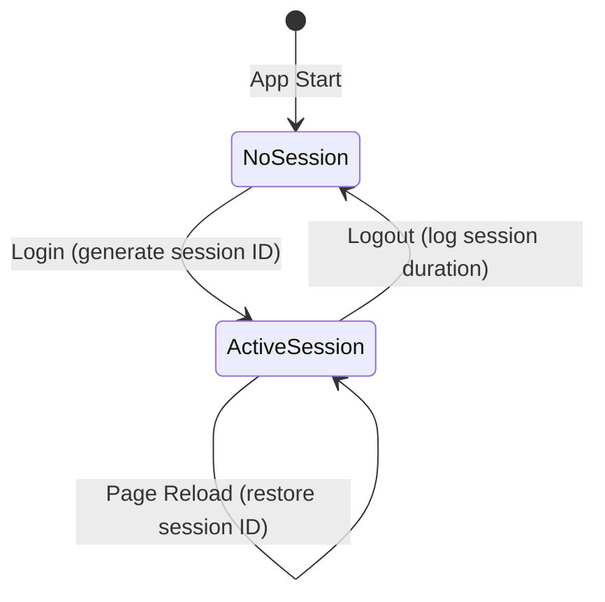
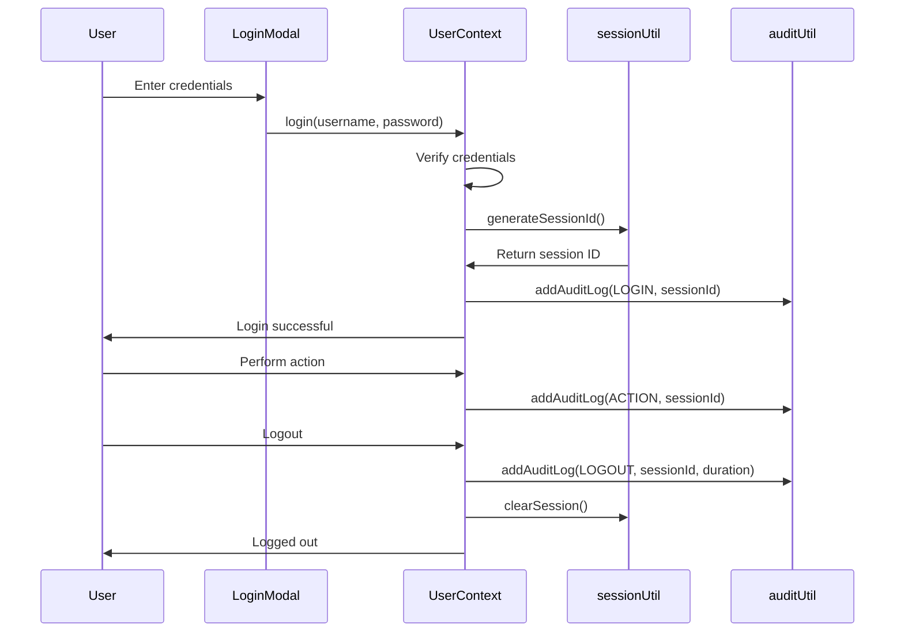

# Comprehensive Audit LoggingComprehensive Audit Logging

## Overview

Enhance audit logging system to capture comprehensive activity data including session tracking, login/logout events, user CRUD operations, password changes, and bulk assignments. This ensures better traceability, accountability, and system monitoring.

**Priority**: P4 🟣  
**Estimated Effort**: Small (~140 lines)  
**Epic Brief**: spec:748b1b3b-90e0-4bf7-b047-6c0b0e63bf03/4b4b1fad-607b-4dfb-a460-d5163a2f59b4 (Problem 6: Audit Logs Enhancement)  
**Core Flows**: spec:748b1b3b-90e0-4bf7-b047-6c0b0e63bf03/ec02edf7-4add-40db-a8e3-bdce84d29b9e (Flow 6: Audit Logs Enhancement)  
**Tech Plan**: spec:748b1b3b-90e0-4bf7-b047-6c0b0e63bf03/b3ce69ee-746e-4d0b-80db-80f3c562a607 (Section 4: Audit Logging Architecture)

---

## Problem Statement

Currently:
- Audit logs track basic actions but lack comprehensive coverage
- No session ID tracking for correlating related actions
- No login/logout event logging
- No user creation/update/delete logging
- Password changes not logged separately from other user updates
- Bulk operations not logged distinctly

This ticket enhances audit logging to capture all critical system events.

---

## Scope

### In Scope
1. **Add session ID generation and tracking**
   - Generate unique session ID on login
   - Include session ID in all audit log entries
   - Store session ID in SessionStorage

2. **Add login/logout audit logging**
   - Log successful login events
   - Log logout events with session duration
   - Log failed login attempts

3. **Add user CRUD audit logging**
   - Log user creation with initial data
   - Log user updates with before/after values
   - Log user deletion with final data

4. **Add password change audit logging**
   - Log self-service password changes (from T1)
   - Distinguish from admin password resets
   - Include old/new password in log (for admin visibility)

5. **Add bulk assignment audit logging**
   - Log bulk case assignments (from T4)
   - Include count of cases and target user
   - Single log entry for bulk operation

6. **Enhance audit log entries**
   - Add IP address if available (from request headers)
   - Ensure device info captured (already exists)
   - Ensure before/after values captured (already exists)

### Out of Scope
- AuditLogViewer UI changes (already complete)
- Audit log storage structure changes (already adequate)
- Real-time audit log streaming
- Audit log retention policies

---

## Session ID System

### Session ID Generation
```typescript
// In session.ts utility
function generateSessionId(): string {
  return `session_${Date.now()}_${Math.random().toString(36).substr(2, 9)}`;
}
```

### Session Lifecycle


### Session Storage
- Store in SessionStorage (persists during browser session)
- Include in all audit log entries
- Clear on logout

---

## Audit Log Entry Structure

### Enhanced SystemAuditLog Type
```typescript
interface SystemAuditLog {
  id: string;
  timestamp: string;
  userId: string;
  userName: string;
  action: AuditAction;
  category: 'Lead' | 'Case' | 'User' | 'Security' | 'System';
  entityType: string;
  entityId: string;
  beforeValue?: any;
  afterValue?: any;
  changesSummary?: string;
  deviceInfo?: string;
  ipAddress?: string;        // NEW
  sessionId?: string;        // NEW
  metadata?: Record<string, any>;
}
```

---

## New Audit Actions

### Security Category
- `LOGIN` - User logged in
- `LOGOUT` - User logged out
- `LOGIN_FAILED` - Login attempt failed
- `PASSWORD_CHANGED` - User changed own password
- `PASSWORD_RESET` - Admin reset user password
- `IMPERSONATION_STARTED` - Admin started impersonating user
- `IMPERSONATION_STOPPED` - Admin stopped impersonating

### User Category
- `USER_CREATED` - New user created
- `USER_UPDATED` - User details updated
- `USER_DELETED` - User deleted
- `USER_ACTIVATED` - User activated
- `USER_DEACTIVATED` - User deactivated

### Case Category (Enhanced)
- `CASE_BULK_ASSIGNED` - Multiple cases assigned in bulk

---

## Implementation Flow



---

## Acceptance Criteria

### Session ID Tracking
- [ ] Session ID generated on successful login
- [ ] Session ID stored in SessionStorage
- [ ] Session ID included in all audit log entries
- [ ] Session ID persists across page reloads
- [ ] Session ID cleared on logout
- [ ] Session ID unique for each login session

### Login/Logout Logging
- [ ] Successful login creates audit log with action `LOGIN`
- [ ] Login log includes: timestamp, user, device info, session ID
- [ ] Failed login creates audit log with action `LOGIN_FAILED`
- [ ] Failed login log includes: timestamp, attempted username, device info
- [ ] Logout creates audit log with action `LOGOUT`
- [ ] Logout log includes: timestamp, user, session ID, session duration
- [ ] Session duration calculated correctly (logout time - login time)

### User CRUD Logging
- [ ] User creation creates audit log with action `USER_CREATED`
- [ ] User creation log includes: new user data, created by
- [ ] User update creates audit log with action `USER_UPDATED`
- [ ] User update log includes: before/after values, updated by
- [ ] User deletion creates audit log with action `USER_DELETED`
- [ ] User deletion log includes: deleted user data, deleted by
- [ ] User activation/deactivation logged separately

### Password Change Logging
- [ ] Self-service password change creates audit log with action `PASSWORD_CHANGED`
- [ ] Password change log includes: user, old/new password, timestamp
- [ ] Admin password reset creates audit log with action `PASSWORD_RESET`
- [ ] Password reset log includes: target user, reset by, new password
- [ ] Password change logs distinguish between self-service and admin reset

### Bulk Assignment Logging
- [ ] Bulk case assignment creates audit log with action `CASE_BULK_ASSIGNED`
- [ ] Bulk assignment log includes: case count, case IDs, target user, assigned by
- [ ] Single log entry created for entire bulk operation (not one per case)
- [ ] Bulk assignment log includes session ID

### Enhanced Audit Log Fields
- [ ] IP address captured if available (from request headers or browser API)
- [ ] Device info captured (User-Agent) - already exists
- [ ] Before/after values captured for updates - already exists
- [ ] Changes summary generated - already exists
- [ ] Session ID included in all logs
- [ ] Metadata field used for additional context

### Integration with Existing System
- [ ] AuditLogViewer displays new log types correctly
- [ ] AuditLogViewer filters work with new categories
- [ ] AuditLogViewer search works with new actions
- [ ] Existing audit logs still display correctly
- [ ] No breaking changes to audit log structure

### Error Handling
- [ ] Audit logging failures don't break main functionality
- [ ] Errors logged to console for debugging
- [ ] Graceful degradation if session ID generation fails
- [ ] Graceful degradation if IP address unavailable

---

## Files to Modify

### file:app/context/UserContext.tsx (~80 lines)
- Import session utility
- Generate session ID on login
- Add login audit log
- Add logout audit log with duration
- Add failed login audit log
- Add user creation audit log
- Add user update audit log
- Add user deletion audit log
- Add password change audit log (for self-service)
- Include session ID in all audit logs

### file:app/context/CaseContext.tsx (~20 lines)
- Add bulk assignment audit log
- Include session ID in audit logs
- Include case count and IDs in metadata

### file:app/utils/session.ts (~40 lines)
- Add `generateSessionId` function
- Add `getSessionId` function
- Add `setSessionId` function
- Add `clearSession` function
- Add `getSessionDuration` function

---

## Audit Log Examples

### Login Event
```typescript
{
  id: "audit_123",
  timestamp: "2024-01-15T10:30:00Z",
  userId: "user_456",
  userName: "John Doe",
  action: "LOGIN",
  category: "Security",
  entityType: "User",
  entityId: "user_456",
  deviceInfo: "Mozilla/5.0 (Windows NT 10.0; Win64; x64)...",
  ipAddress: "192.168.1.100",
  sessionId: "session_1705318200000_abc123xyz",
  metadata: {
    loginMethod: "password"
  }
}
```

### Password Change Event
```typescript
{
  id: "audit_124",
  timestamp: "2024-01-15T10:35:00Z",
  userId: "user_456",
  userName: "John Doe",
  action: "PASSWORD_CHANGED",
  category: "Security",
  entityType: "User",
  entityId: "user_456",
  beforeValue: "oldPassword123",
  afterValue: "newPassword456",
  changesSummary: "User changed their own password",
  deviceInfo: "Mozilla/5.0 (Windows NT 10.0; Win64; x64)...",
  sessionId: "session_1705318200000_abc123xyz",
  metadata: {
    changeType: "SELF_CHANGE"
  }
}
```

### Bulk Assignment Event
```typescript
{
  id: "audit_125",
  timestamp: "2024-01-15T10:40:00Z",
  userId: "user_789",
  userName: "Jane Smith",
  action: "CASE_BULK_ASSIGNED",
  category: "Case",
  entityType: "ProcessCase",
  entityId: "multiple",
  changesSummary: "Assigned 5 cases to John Doe (Process Manager)",
  deviceInfo: "Mozilla/5.0 (Windows NT 10.0; Win64; x64)...",
  sessionId: "session_1705318200000_xyz789abc",
  metadata: {
    caseCount: 5,
    caseIds: ["case_1", "case_2", "case_3", "case_4", "case_5"],
    targetUserId: "user_456",
    targetUserName: "John Doe",
    targetRole: "PROCESS_MANAGER"
  }
}
```

---

## Testing Checklist

- [ ] Session ID generated on login
- [ ] Session ID persists across page reloads
- [ ] Session ID cleared on logout
- [ ] Login event logged with correct data
- [ ] Logout event logged with session duration
- [ ] Failed login logged with attempted username
- [ ] User creation logged with new user data
- [ ] User update logged with before/after values
- [ ] User deletion logged with deleted user data
- [ ] Self-service password change logged correctly
- [ ] Admin password reset logged correctly
- [ ] Bulk assignment logged with case count
- [ ] All logs include session ID
- [ ] IP address captured if available
- [ ] Device info captured correctly
- [ ] AuditLogViewer displays new log types
- [ ] Filtering works with new categories
- [ ] Search works with new actions
- [ ] No console errors or warnings
- [ ] Audit logging failures don't break app

---

## Dependencies

**Soft Dependencies**:
- ticket:748b1b3b-90e0-4bf7-b047-6c0b0e63bf03/T1 (Core Password Management) - for password change logs
- ticket:748b1b3b-90e0-4bf7-b047-6c0b0e63bf03/T4 (Bulk Case Assignment) - for bulk assignment logs

**Note**: This ticket can be worked in parallel with T1 and T4. The audit logging code can be added even if those features aren't complete yet.

---

## Related Tickets

- **Related**: ticket:748b1b3b-90e0-4bf7-b047-6c0b0e63bf03/T1 (Core Password Management Foundation)
- **Related**: ticket:748b1b3b-90e0-4bf7-b047-6c0b0e63bf03/T2 (Admin User Management UI)
- **Related**: ticket:748b1b3b-90e0-4bf7-b047-6c0b0e63bf03/T3 (Admin Impersonation UI)
- **Related**: ticket:748b1b3b-90e0-4bf7-b047-6c0b0e63bf03/T4 (Bulk Case Assignment System)
## Overview

Enhance audit logging system to capture comprehensive activity data including session tracking, login/logout events, user CRUD operations, password changes, and bulk assignments. This ensures better traceability, accountability, and system monitoring.

**Priority**: P4 🟣  
**Estimated Effort**: Small (~140 lines)  
**Epic Brief**: spec:748b1b3b-90e0-4bf7-b047-6c0b0e63bf03/4b4b1fad-607b-4dfb-a460-d5163a2f59b4 (Problem 6: Audit Logs Enhancement)  
**Core Flows**: spec:748b1b3b-90e0-4bf7-b047-6c0b0e63bf03/ec02edf7-4add-40db-a8e3-bdce84d29b9e (Flow 6: Audit Logs Enhancement)  
**Tech Plan**: spec:748b1b3b-90e0-4bf7-b047-6c0b0e63bf03/b3ce69ee-746e-4d0b-80db-80f3c562a607 (Section 4: Audit Logging Architecture)

---

## Problem Statement

Currently:
- Audit logs track basic actions but lack comprehensive coverage
- No session ID tracking for correlating related actions
- No login/logout event logging
- No user creation/update/delete logging
- Password changes not logged separately from other user updates
- Bulk operations not logged distinctly

This ticket enhances audit logging to capture all critical system events.

---

## Scope

### In Scope
1. **Add session ID generation and tracking**
   - Generate unique session ID on login
   - Include session ID in all audit log entries
   - Store session ID in SessionStorage

2. **Add login/logout audit logging**
   - Log successful login events
   - Log logout events with session duration
   - Log failed login attempts

3. **Add user CRUD audit logging**
   - Log user creation with initial data
   - Log user updates with before/after values
   - Log user deletion with final data

4. **Add password change audit logging**
   - Log self-service password changes (from T1)
   - Distinguish from admin password resets
   - Include old/new password in log (for admin visibility)

5. **Add bulk assignment audit logging**
   - Log bulk case assignments (from T4)
   - Include count of cases and target user
   - Single log entry for bulk operation

6. **Enhance audit log entries**
   - Add IP address if available (from request headers)
   - Ensure device info captured (already exists)
   - Ensure before/after values captured (already exists)

### Out of Scope
- AuditLogViewer UI changes (already complete)
- Audit log storage structure changes (already adequate)
- Real-time audit log streaming
- Audit log retention policies

---

## Session ID System

### Session ID Generation
```typescript
// In session.ts utility
function generateSessionId(): string {
  return `session_${Date.now()}_${Math.random().toString(36).substr(2, 9)}`;
}
```

### Session Lifecycle


### Session Storage
- Store in SessionStorage (persists during browser session)
- Include in all audit log entries
- Clear on logout

---

## Audit Log Entry Structure

### Enhanced SystemAuditLog Type
```typescript
interface SystemAuditLog {
  id: string;
  timestamp: string;
  userId: string;
  userName: string;
  action: AuditAction;
  category: 'Lead' | 'Case' | 'User' | 'Security' | 'System';
  entityType: string;
  entityId: string;
  beforeValue?: any;
  afterValue?: any;
  changesSummary?: string;
  deviceInfo?: string;
  ipAddress?: string;        // NEW
  sessionId?: string;        // NEW
  metadata?: Record;
}
```

---

## New Audit Actions

### Security Category
- `LOGIN` - User logged in
- `LOGOUT` - User logged out
- `LOGIN_FAILED` - Login attempt failed
- `PASSWORD_CHANGED` - User changed own password
- `PASSWORD_RESET` - Admin reset user password
- `IMPERSONATION_STARTED` - Admin started impersonating user
- `IMPERSONATION_STOPPED` - Admin stopped impersonating

### User Category
- `USER_CREATED` - New user created
- `USER_UPDATED` - User details updated
- `USER_DELETED` - User deleted
- `USER_ACTIVATED` - User activated
- `USER_DEACTIVATED` - User deactivated

### Case Category (Enhanced)
- `CASE_BULK_ASSIGNED` - Multiple cases assigned in bulk

---

## Implementation Flow


---

## Acceptance Criteria

### Session ID Tracking
- [ ] Session ID generated on successful login
- [ ] Session ID stored in SessionStorage
- [ ] Session ID included in all audit log entries
- [ ] Session ID persists across page reloads
- [ ] Session ID cleared on logout
- [ ] Session ID unique for each login session

### Login/Logout Logging
- [ ] Successful login creates audit log with action `LOGIN`
- [ ] Login log includes: timestamp, user, device info, session ID
- [ ] Failed login creates audit log with action `LOGIN_FAILED`
- [ ] Failed login log includes: timestamp, attempted username, device info
- [ ] Logout creates audit log with action `LOGOUT`
- [ ] Logout log includes: timestamp, user, session ID, session duration
- [ ] Session duration calculated correctly (logout time - login time)

### User CRUD Logging
- [ ] User creation creates audit log with action `USER_CREATED`
- [ ] User creation log includes: new user data, created by
- [ ] User update creates audit log with action `USER_UPDATED`
- [ ] User update log includes: before/after values, updated by
- [ ] User deletion creates audit log with action `USER_DELETED`
- [ ] User deletion log includes: deleted user data, deleted by
- [ ] User activation/deactivation logged separately

### Password Change Logging
- [ ] Self-service password change creates audit log with action `PASSWORD_CHANGED`
- [ ] Password change log includes: user, old/new password, timestamp
- [ ] Admin password reset creates audit log with action `PASSWORD_RESET`
- [ ] Password reset log includes: target user, reset by, new password
- [ ] Password change logs distinguish between self-service and admin reset

### Bulk Assignment Logging
- [ ] Bulk case assignment creates audit log with action `CASE_BULK_ASSIGNED`
- [ ] Bulk assignment log includes: case count, case IDs, target user, assigned by
- [ ] Single log entry created for entire bulk operation (not one per case)
- [ ] Bulk assignment log includes session ID

### Enhanced Audit Log Fields
- [ ] IP address captured if available (from request headers or browser API)
- [ ] Device info captured (User-Agent) - already exists
- [ ] Before/after values captured for updates - already exists
- [ ] Changes summary generated - already exists
- [ ] Session ID included in all logs
- [ ] Metadata field used for additional context

### Integration with Existing System
- [ ] AuditLogViewer displays new log types correctly
- [ ] AuditLogViewer filters work with new categories
- [ ] AuditLogViewer search works with new actions
- [ ] Existing audit logs still display correctly
- [ ] No breaking changes to audit log structure

### Error Handling
- [ ] Audit logging failures don't break main functionality
- [ ] Errors logged to console for debugging
- [ ] Graceful degradation if session ID generation fails
- [ ] Graceful degradation if IP address unavailable

---

## Files to Modify

### file:app/context/UserContext.tsx (~80 lines)
- Import session utility
- Generate session ID on login
- Add login audit log
- Add logout audit log with duration
- Add failed login audit log
- Add user creation audit log
- Add user update audit log
- Add user deletion audit log
- Add password change audit log (for self-service)
- Include session ID in all audit logs

### file:app/context/CaseContext.tsx (~20 lines)
- Add bulk assignment audit log
- Include session ID in audit logs
- Include case count and IDs in metadata

### file:app/utils/session.ts (~40 lines)
- Add `generateSessionId` function
- Add `getSessionId` function
- Add `setSessionId` function
- Add `clearSession` function
- Add `getSessionDuration` function

---

## Audit Log Examples

### Login Event
```typescript
{
  id: "audit_123",
  timestamp: "2024-01-15T10:30:00Z",
  userId: "user_456",
  userName: "John Doe",
  action: "LOGIN",
  category: "Security",
  entityType: "User",
  entityId: "user_456",
  deviceInfo: "Mozilla/5.0 (Windows NT 10.0; Win64; x64)...",
  ipAddress: "192.168.1.100",
  sessionId: "session_1705318200000_abc123xyz",
  metadata: {
    loginMethod: "password"
  }
}
```

### Password Change Event
```typescript
{
  id: "audit_124",
  timestamp: "2024-01-15T10:35:00Z",
  userId: "user_456",
  userName: "John Doe",
  action: "PASSWORD_CHANGED",
  category: "Security",
  entityType: "User",
  entityId: "user_456",
  beforeValue: "oldPassword123",
  afterValue: "newPassword456",
  changesSummary: "User changed their own password",
  deviceInfo: "Mozilla/5.0 (Windows NT 10.0; Win64; x64)...",
  sessionId: "session_1705318200000_abc123xyz",
  metadata: {
    changeType: "SELF_CHANGE"
  }
}
```

### Bulk Assignment Event
```typescript
{
  id: "audit_125",
  timestamp: "2024-01-15T10:40:00Z",
  userId: "user_789",
  userName: "Jane Smith",
  action: "CASE_BULK_ASSIGNED",
  category: "Case",
  entityType: "ProcessCase",
  entityId: "multiple",
  changesSummary: "Assigned 5 cases to John Doe (Process Manager)",
  deviceInfo: "Mozilla/5.0 (Windows NT 10.0; Win64; x64)...",
  sessionId: "session_1705318200000_xyz789abc",
  metadata: {
    caseCount: 5,
    caseIds: ["case_1", "case_2", "case_3", "case_4", "case_5"],
    targetUserId: "user_456",
    targetUserName: "John Doe",
    targetRole: "PROCESS_MANAGER"
  }
}
```

---

## Testing Checklist

- [ ] Session ID generated on login
- [ ] Session ID persists across page reloads
- [ ] Session ID cleared on logout
- [ ] Login event logged with correct data
- [ ] Logout event logged with session duration
- [ ] Failed login logged with attempted username
- [ ] User creation logged with new user data
- [ ] User update logged with before/after values
- [ ] User deletion logged with deleted user data
- [ ] Self-service password change logged correctly
- [ ] Admin password reset logged correctly
- [ ] Bulk assignment logged with case count
- [ ] All logs include session ID
- [ ] IP address captured if available
- [ ] Device info captured correctly
- [ ] AuditLogViewer displays new log types
- [ ] Filtering works with new categories
- [ ] Search works with new actions
- [ ] No console errors or warnings
- [ ] Audit logging failures don't break app

---

## Dependencies

**Soft Dependencies**:
- ticket:748b1b3b-90e0-4bf7-b047-6c0b0e63bf03/T1 (Core Password Management) - for password change logs
- ticket:748b1b3b-90e0-4bf7-b047-6c0b0e63bf03/T4 (Bulk Case Assignment) - for bulk assignment logs

**Note**: This ticket can be worked in parallel with T1 and T4. The audit logging code can be added even if those features aren't complete yet.

---

## Related Tickets

- **Related**: ticket:748b1b3b-90e0-4bf7-b047-6c0b0e63bf03/T1 (Core Password Management Foundation)
- **Related**: ticket:748b1b3b-90e0-4bf7-b047-6c0b0e63bf03/T2 (Admin User Management UI)
- **Related**: ticket:748b1b3b-90e0-4bf7-b047-6c0b0e63bf03/T3 (Admin Impersonation UI)
- **Related**: ticket:748b1b3b-90e0-4bf7-b047-6c0b0e63bf03/T4 (Bulk Case Assignment System)


